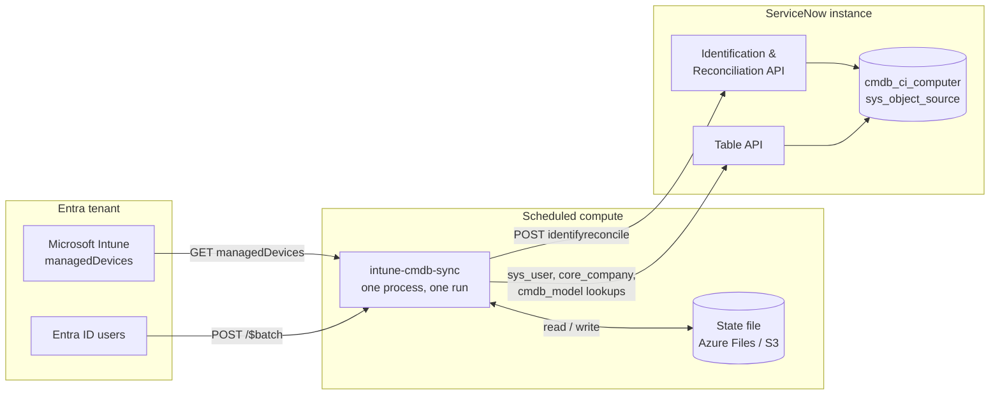

# Architecture design

How `intune-cmdb-sync` is put together, and why it is shaped this way.

Audience: anyone who has to operate, review, or extend the system. For the
field-level mapping rules see [field-mapping.md](field-mapping.md); for the
CMDB modelling decisions see [metamodel-mapping.md](metamodel-mapping.md).

---

## 1. Problem statement

ServiceNow's Service Graph Connector for Microsoft Intune solves this problem,
but it is built on IntegrationHub ETL, which is separately subscribed. Many
organisations own ServiceNow ITSM and Intune without owning IntegrationHub.

The capability that actually protects CMDB data quality — the Identification
and Reconciliation Engine (IRE) — is base platform, and it is reachable by any
caller holding `itil` or `asset` through the Identification and Reconciliation
API. This system performs extract and transform *outside* the instance and
posts an IRE-shaped payload to that endpoint.

The trade is explicit: you get IRE deduplication, reconciliation, source
precedence, and identity keyed on the Intune device GUID. You give up
vendor-maintained mappings, the ETL UI, and ServiceNow support for the
integration.

---

## 2. System context



The process is stateless apart from one small JSON file. It holds no queue, no
database, and no long-lived connections. A run either completes or does not;
the next run starts from Intune's current truth regardless.

---

## 3. Run pipeline

A single run is a linear pipeline, orchestrated by `SyncRunner.run` in
[`sync.py`](../src/intune_cmdb_sync/sync.py):

| # | Stage | Module | Notes |
|---|---|---|---|
| 1 | Verify ServiceNow connectivity | `servicenow/client.py` | Fails fast before touching Graph |
| 2 | Fetch managed devices | `graph.py` | Paged via `@odata.nextLink` |
| 3 | Filter by ownership | `graph.py` | Client-side, always |
| 4 | Optional hardware detail | `graph.py` | One call per device; off by default |
| 5 | Resolve owners | `user_resolver.py` | Entra user → `sys_user` |
| 6 | Prime reference caches | `reference_resolver.py` | Manufacturer, model |
| 7 | Build payloads | `mapping.py` | Pure; no I/O |
| 8 | Write in batches | `servicenow/writers.py` | IRE bulk POST |
| 9 | Retire absent devices | `sync.py` | Guarded; off by default |
| 10 | Persist state, emit report | `state.py`, `models.py` | |

Stages 1–7 cannot modify the CMDB. Every write is concentrated in stages 8 and
9, which is what makes `--dry-run` meaningful and what keeps the blast radius
of a change reviewable.

### Ownership filtering is deliberately redundant

The connector asks Graph to filter server-side (`$filter=managedDeviceOwnerType
eq 'company'`) but **also** filters client-side, unconditionally. Graph does not
formally document that property as filterable, so a silently-ignored filter is
possible. A 400 from the filtered request falls back to an unfiltered fetch.

Either way the client-side check runs, so personally-owned devices cannot leak
into the CMDB through a server-side filter that stopped working.

---

## 4. Key design decisions

### 4.1 IRE bulk write, not the Table API

Writing CIs directly to `cmdb_ci_computer` through the Table API would bypass
identification and reconciliation entirely — no deduplication, no source
precedence, no protection against overwriting another discovery source's better
data. It would also be faster to build and far worse for the CMDB.

`POST /api/now/identifyreconcile` takes a bulk `items` array in a single
request and carries `sys_object_source_info`, which is what keys each CI to the
Intune device GUID. This is the recommended path and the default.

A `cmdb_instance` fallback writer exists for instances where the
identifyreconcile endpoint is blocked. It is strictly worse — one HTTP call per
CI, no slot for `sys_object_source_info`, so it re-identifies on serial number
every run. Documented, supported, not recommended.

### 4.2 Full sync every run, no delta query

Graph v1.0 exposes no delta query for `managedDevices`. Rather than simulate one
with timestamp filtering — which silently misses devices whose properties change
without a check-in — every run reads the full inventory.

A daily full pass over even a large tenant is a few minutes of a process that
costs under $0.10/month to run. Correctness is worth more than the saving.

### 4.3 Plain REST for Graph data, SDK for auth

Token acquisition uses `azure-identity`, Microsoft's first-party auth SDK, so
client secrets, managed identity, and workload-identity federation all work
through one code path with SDK-managed caching and refresh. Rolling that by hand
is a well-known source of subtle bugs.

The Graph *data* calls are plain REST. The surface used here is four endpoints,
and `msgraph-sdk` brings the Kiota dependency tree, which is substantial weight
for an image whose entire job is one HTTP loop a day. The endpoints are
documented and stable. This trade is deliberate and should not be revisited
casually.

### 4.4 Batching and request volume

Request volume against ServiceNow is bounded and does not scale linearly with
fleet size. For N devices, U unique owners, R distinct manufacturers and models:

```
1              connectivity check
ceil(R/40) x2  reference prime      once per run, then cached
ceil(U/50)     sys_user lookups     chunked, OR-chained, cached
ceil(N/100)    IRE bulk POST        sequential, not concurrent
<= 0.1 x N     retirement PATCH     the only unbatched path, guard-bounded
```

Lookups use OR-chained equality rather than the `IN` operator, because `IN`
takes a comma-separated list and real inventory data is full of commas. An `IN`
list containing `MacBook Pro (16-inch, 2023)` does not error — it silently
matches nothing.

### 4.5 Throttling

Both Graph and ServiceNow throttle with 429 and `Retry-After`. The shared
[`RetryingClient`](../src/intune_cmdb_sync/http.py) honours that header, falls
back to ServiceNow's `X-RateLimit-Reset` when it is absent, and otherwise uses
exponential backoff with full jitter, capped at 120 seconds per attempt.

Throttle warnings log `X-RateLimit-Remaining` and `X-RateLimit-Limit`, which is
what makes a real instance's actual budget discoverable rather than guessed.

---

## 5. State and retirement

The only thing that genuinely must persist between runs is the map of Intune
device ID → CMDB sys_id. It exists so a later run can retire CIs for devices
that have left Intune, without reverse-engineering which CIs this connector
owns.

Storage is chosen by the shape of `STATE_PATH`: a filesystem path (Azure Files,
container volume, laptop) or an `s3://` URL. The S3 backend exists for one
reason — a Lambda placed in a VPC to reach EFS also needs a NAT gateway to reach
Graph, and a NAT gateway costs more per month than everything else in this
design combined.

Without state the connector still works; it just cannot retire anything.

**Retirement is guarded.** If the fraction of known devices now missing exceeds
`SNOW_RETIRE_MAX_FRACTION` (default 10%), the connector refuses to retire
anything and reports why. A fleet does not vanish overnight; an incomplete
Graph fetch looks exactly like one that did. Retirement is also off by default.

---

## 6. Failure model

| Failure | Behaviour | Exit |
|---|---|---|
| Invalid configuration | Every problem listed at once, before any I/O | 2 |
| Auth or connectivity failure | Abort; partial report still written | 3 |
| Whole batch rejected | Every device in the batch marked `error` | 0 / 4 |
| One device rejected | That device marked `error`; run continues | 0 / 4 |
| Safety guard tripped | Nothing retired; run marked **degraded** | 4 |
| State write fails | CIs written, bookkeeping lost; **degraded** | 4 |

The degraded distinction matters. A tripped guard or a lost state file leaves
the *next* run unable to reason about the fleet, so it reaches the scheduler as
a non-zero exit rather than scrolling past in a log. See `RunReport.degraded`.

---

## 7. Deployment topologies

Both are scheduled-container deployments of the same image. Pick on credential
model, not cost — the difference is under $0.15/month.

**Azure Container Apps Jobs** (`deploy/azure/`) — cron-triggered job, Key Vault
for secrets accessed by user-assigned managed identity, Azure Files for state,
Log Analytics for output.

**AWS Lambda** (`deploy/aws/`) — container-image Lambda on an EventBridge
schedule, SSM Parameter Store for secrets, S3 for state, deliberately outside a
VPC.

**Anywhere else** — the image is a plain CLI. Any cron, any Kubernetes
CronJob, any CI scheduler works.

### Graph authentication and tenant topology

`GRAPH_AUTH_MODE=client_secret` is the default and works everywhere.

`managed_identity` is the better option when available — no secret exists at
all — but a managed identity is **single-tenant**. When Intune lives in a
different tenant from the hosting subscription, it cannot be granted Graph app
roles in that other directory and there is no consent path. `deploy.sh` hard-
fails on that combination rather than producing a deployment that 403s at 3am.

`federated_managed_identity` is the option that is both secretless *and*
cross-tenant: a managed identity in the hosting tenant signs a client assertion
for a multi-tenant app registration consented into the Intune tenant. It is
implemented and supported by `main.bicep`, but the two-tenant setup it depends
on cannot be automated from one login. See [entra-setup.md](entra-setup.md).

`workload_identity` exists for AKS and GitHub Actions OIDC, which project a
federated token file. Container Apps does not, so `deploy/azure` deliberately
does not offer it.

---

## 8. The ServiceNow-side application

`servicenow-app/` is a scoped application authored with the ServiceNow Fluent
SDK. It ships **no runtime logic** — the sync runs outside the instance.

What it provides is the platform configuration the connector depends on,
captured as code so it is versioned and reproducible across dev/test/prod rather
than clicked in by hand:

- the `Intune` discovery source choice value, without which every IRE write is
  rejected as `Invalid data source`;
- an integration role for audit-trail identifiability;
- instance properties documenting the expected sync shape;
- optionally, a `u_entra_object_id` column on `sys_user` for stable owner
  matching.

---

## 9. Known limitations

- Computers only by default. Mobile device classes vary by instance and release;
  the connector will not guess one.
- No software inventory (`cmdb_sam_sw_install`).
- No relationships (`cmdb_rel_ci`).
- Full sync each run; no delta.
- `install_status=7` for retired is the common convention, not a guarantee.

## 10. Verification status

The Microsoft Graph half is verified against a live tenant. **The ServiceNow
half has never touched a live instance.** The test suite mocks at the HTTP
boundary with `respx`, and those fixtures were written from vendor
documentation rather than observed responses. Green tests are weaker evidence
here than they look. See [engineering-guide.md](engineering-guide.md) for what
to verify first.
