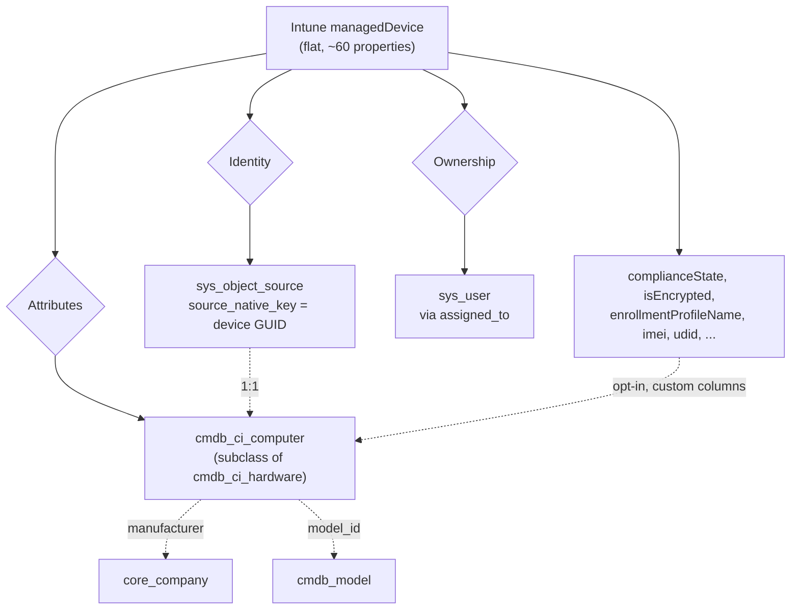

# Metamodel mapping design

How the Intune device model is projected onto the ServiceNow CMDB metamodel.

This document is about **modelling decisions** — classes, identity, precedence,
and reconciliation semantics. The field-by-field table lives in
[field-mapping.md](field-mapping.md); this explains the model those fields sit
in and why the boundaries were drawn where they were.

---

## 1. The two metamodels

**Intune's model** is flat. A `managedDevice` is a single object with ~60
properties covering hardware, enrolment, compliance, and a denormalised copy of
its owner's identity. There is no inheritance, no relationships, and no notion
of a configuration item's lifecycle beyond enrolment state.

**ServiceNow's CMDB** is a class hierarchy rooted at `cmdb_ci`, with typed
reference fields, a separate source-tracking table, per-class identification
rules, and reconciliation precedence between competing data sources.

The projection is therefore lossy in one direction and lossy-by-choice in the
other: Intune knows things the CMDB has no home for, and the CMDB models
things — relationships, software installs, lifecycle — that Intune cannot tell
us about.



---

## 2. Class selection

### 2.1 Routing rule

Class is resolved from the Intune `operatingSystem` string through
`SNOW_CLASS_MAP`, falling back to `SNOW_DEFAULT_CLASS`. The shipped default
routes Windows and macOS to `cmdb_ci_computer` and maps nothing else.

An OS matching neither the map nor a default is **skipped and reported**, not
guessed. This is a deliberate design choice, not an omission.

### 2.2 Why the connector refuses to guess

Guessing a class name that does not exist in the target instance fails at write
time with an IRE error that is considerably harder to diagnose than a skip
counted in the run report. More importantly, the correct class for handheld
hardware genuinely varies:

| Hardware | Common target | Varies by |
|---|---|---|
| Windows / macOS laptops, desktops | `cmdb_ci_computer` | Stable across instances |
| Phones, tablets | a handheld class | Instance and release |
| Virtual machines | `cmdb_ci_vm_instance` | Whether the VM story is modelled at all |

ServiceNow's own Intune connector routes phones and tablets to a handheld class
rather than to `cmdb_ci_computer`. Which class that is depends on the release
and on which CMDB plugins the instance has active. Confirm the class exists in
**CI Class Manager** before adding it to the map.

### 2.3 Class is not re-evaluated for existing CIs

If a device's mapped class changes between runs — because you edited
`SNOW_CLASS_MAP`, not because the device changed — IRE receives a payload with
a new `className` for an existing `source_native_key`. IRE's behaviour here is
a **reclassification**, governed by instance reconciliation settings, not
something this connector controls. Change class mappings deliberately and on a
non-production instance first.

---

## 3. Identity model

This is the most important section in the document. Identity is where CMDB
integrations succeed or fail, and the connector uses two mechanisms that operate
at different times.

### 3.1 Primary: source-native key

Every item in `identify_reconcile` mode carries:

```json
"sys_object_source_info": {
  "source_native_key":        "<Intune managedDevice.id>",
  "source_name":              "Intune",
  "source_feed":              "Intune Managed Devices",
  "source_recency_timestamp": "2026-08-25 06:11:02"
}
```

IRE evaluates `source_native_key` **before** any identification rule. Once a
device has been synced, it is matched by its Intune GUID, which is immutable for
the life of the enrolment.

The practical consequence: a motherboard swap, a corrected serial number, or a
device rename does not create a duplicate CI. This is the single largest
data-quality advantage over any integration that identifies on serial number
alone.

### 3.2 Fallback: identification rules

The first time a device is seen there is no source record to match, so IRE falls
back to the class's identification rules — for `cmdb_ci_computer`, normally
serial number, then name.

This is also the *only* mechanism available in `cmdb_instance` write mode, which
has no documented slot for `sys_object_source_info`. That mode therefore
re-identifies on serial number every run and will duplicate a CI whose serial
changes. It exists for instances where the identifyreconcile endpoint is
blocked, and it is strictly worse.

### 3.3 Why serial normalisation is an identity concern

Firmware vendors ship placeholder serials — `To be filled by O.E.M.`, `Default
string`, `0000000000`. If one reaches IRE as a real serial, **every machine
sharing that placeholder identifies as the same CI** and the fleet collapses
into a single record. This is the most destructive failure mode in the system.

The connector therefore rejects a blocklist of known placeholders, anything
under three characters, and anything that is a single repeated character once
punctuation is stripped. A device with neither a usable serial nor a name is
skipped outright, because writing it would create a fresh duplicate CI on every
run.

### 3.4 Correlation ID is documentation, not identity

`correlation_id` receives the Intune device GUID when `SNOW_SET_CORRELATION` is
on. It is **not** what IRE matches on — that is `source_native_key`. It exists
so a CMDB administrator looking at a CI in the UI can see where it came from
without querying `sys_object_source`.

---

## 4. Reconciliation and precedence

The CMDB is multi-source by design. A laptop may be reported by Intune, by an
agent-based discovery tool, and by an asset import, each authoritative for
different attributes.

Three mechanisms keep this connector from trampling the others:

**Source recency.** `source_recency_timestamp` carries the device's last Intune
check-in. It lets IRE decide that a stale payload should not overwrite fresher
data from another source. A device that has not checked in for a month will not
overwrite this morning's agent scan.

**Reconciliation rules.** Which source wins for which attribute is configured in
the instance, per class and per field, not in this connector. That is correct:
precedence is a CMDB governance decision, and hard-coding it in an external
process would put it beyond the reach of the people accountable for it.

**Never send empty.** Fields resolving to `None` or an empty string are omitted
from the payload entirely rather than sent as blanks. In an IRE payload an empty
value *is* a value, and it will overwrite good data another source contributed.
This applies to unresolved references too — a failed `manufacturer` lookup
leaves the existing value alone rather than clearing it.

> **Design rule.** Any new field added to the mapping must preserve the
> omit-when-empty property. A field that sends `""` on failure is a data-loss
> bug, not a cosmetic one.

---

## 5. Reference fields

`manufacturer` → `core_company` and `model_id` → `cmdb_model` are typed
reference fields. They require a sys_id, and **IRE will not resolve a display
name into a reference** — an unresolved reference is silently dropped or written
as an invalid sys_id.

Intune supplies only strings (`"Apple"`, `"MacBookPro18,3"`), so the connector
resolves them itself, once per run, cached. A ten-thousand machine fleet
typically has fewer than a dozen manufacturers and a few hundred models, so this
is two or three Table API calls rather than twenty thousand.

**Creating missing records is opt-in and off by default.** Auto-creating
`cmdb_model` rows is convenient for CMDB completeness but pollutes Asset
Management's model catalogue if the naming does not match what asset managers
expect. That is the asset team's call, not the integration's. Unresolved names
are reported under `unresolved_references` instead.

---

## 6. Ownership model

Intune reports the owner as an Entra object ID plus a denormalised UPN, email,
and display name. The CMDB needs a `sys_user` sys_id for `assigned_to`. There is
no universal join key between the two directories.

`SNOW_USER_MATCH_ORDER` names candidate keys to try in order, stopping at the
first unambiguous hit:

| Key | Stability | Cost |
|---|---|---|
| `entra_id` | Highest — never changes | Requires populating a custom column |
| `employee_number` | High, when HR feeds both systems | Free if already populated |
| `email` | Medium — breaks on mailbox migration | Free |
| `user_name` | Medium — breaks on domain rename | Free |

Two rules exist specifically to prevent bad data:

- **Ambiguity is not a match.** A key matching more than one `sys_user` is
  treated as no match at all. Assigning a laptop to the wrong person is worse
  than leaving `assigned_to` empty, and far harder to notice.
- **Values are queried as Entra reports them**, not lowercased. Most ServiceNow
  instances collate case-insensitively; Oracle-backed ones do not, and a
  lowercased value would silently stop matching there.

The `u_entra_object_id` column shipped in `servicenow-app/` exists to make the
top row of that table available. It is optional — delete the file if you do not
want the connector's application touching the global `sys_user` dictionary.

---

## 7. Attribute churn

The connector sends the **full attribute set every run** and lets IRE diff it.
There is no client-side change detection.

The consequence is that any field whose value moves between runs makes every
device an `UPDATE`, forever. The classic offender is `last_discovered`, mapped
from `lastSyncDateTime`, which Intune bumps every time a device checks in —
several times a day. Left in place, `NO_CHANGE` never occurs, every CI's
`sys_updated_on` is bumped daily, and every business rule on the class fires
fleet-wide once a day.

Dropping it costs nothing, because `source_recency_timestamp` already carries
the same information onto `sys_object_source`:

```json
{ "drop": ["last_discovered"] }
```

With that in place, an `UPDATE` becomes meaningful signal: the device name, its
assigned user, or its OS version actually changed.

> **Design rule.** Before adding a field to the default mapping, ask how often
> its value changes. Anything that moves on every device check-in belongs in a
> custom column the operator opts into, not in the defaults.

---

## 8. What is deliberately out of scope

| Not modelled | Why |
|---|---|
| Software installs (`cmdb_sam_sw_install`) | Different Graph endpoint, different volume profile, different licensing implications |
| Relationships (`cmdb_rel_ci`) | Intune reports no topology; inventing edges from device attributes produces confident nonsense |
| Lifecycle beyond install status | Asset lifecycle is owned by Asset Management, sourced from procurement, not from MDM |
| Compliance as a first-class model | Available as `complianceState` on an opt-in custom column; no out-of-box CI field is a good home |

The first is a plausible future extension. The second and third are boundaries
rather than gaps — an MDM feed is the wrong authority for both.
